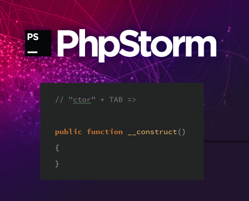

# My Handy PhpStorm Live Templates



## Install

1. Go to *PhpStorm Preferences | Tools | Settings Repository*

2. Add Read-only Source https://github.com/TomasVotruba/PhpStorm-LiveTemplates

3. Restart PhpStorm and profit!


## What is in this package?

#### `st`

```php
declare(strict_types=1);
```

#### `ctor`

```php
public function __construct($END$)
{
}
```

#### `pub`

```php
public function $NAME$($ARGS$)
{
    $END$
}
```

#### `pri`

```php
private function $NAME$($ARGS$)
{
    $END$
}
```

#### `vs`

```php
/**
 * @var string
 */
```

#### `va`

```php
/**
 * @var string[]
 */
```

#### `vi`

```php
/**
 * @var int
 */
```

#### `ra`

```php
/**
 * @return string[]
 */
```
